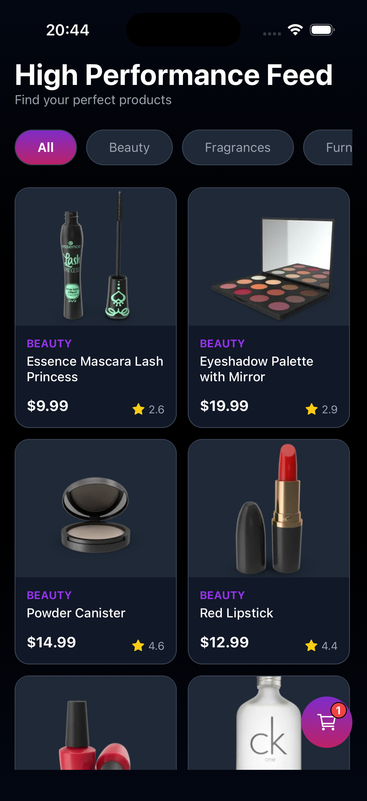
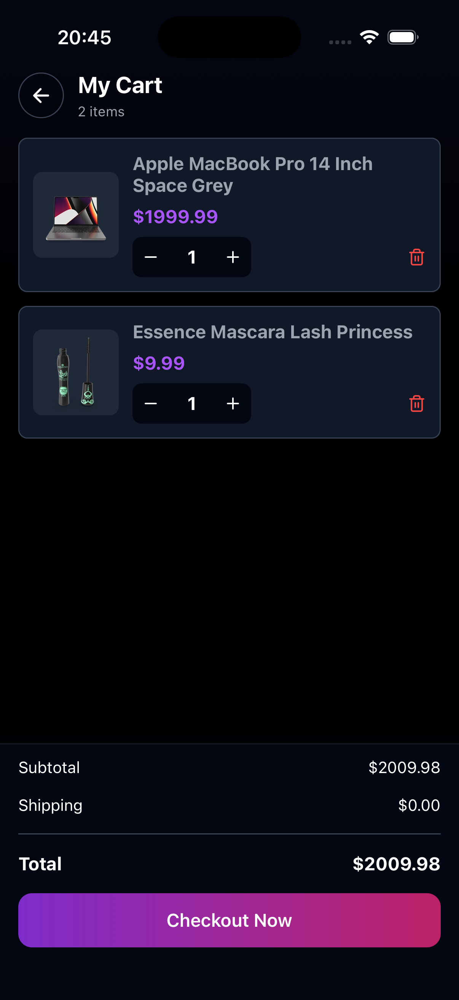
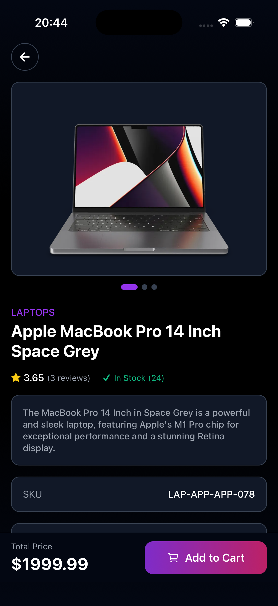

# High Performance Feed

High Performance Feed is a polished, high-performance shopping experience built with **Expo Router**, **React Native**, and **Redux Toolkit**. It showcases:

- A **products listing** with categories and infinite scrolling
- A rich **product details** screen with gallery, reviews, and metadata
- A **cart** experience with quantity controls, totals, and checkout

This README explains how to **set up**, **run**, and **navigate** the project, and documents the structure in detail so a reviewer can quickly understand the architecture.

---

## 1. Screenshots

- **Products Listing (Home)**  
  

- **Cart Screen**  
  

- **Product Details Screen**  
  


---

## 2. Getting Started

### 2.1. Prerequisites

- **Node.js** (LTS is recommended)
- **yarn**, **pnpm**, or **npm** (examples use `yarn` but any works)
- **Expo CLI** (installed globally via `npm i -g expo` is optional but convenient)

### 2.2. Install dependencies

From the project root:

```bash
yarn
```

### 2.3. Environment variables

This app fetches products and categories from [`https://dummyjson.com`](https://dummyjson.com).  
Expo makes public env variables available via the `EXPO_PUBLIC_` prefix.

Create a `.env` file in the project root (alongside `package.json`) with:

```bash
EXPO_PUBLIC_API_URL=https://dummyjson.com
```

There is also an `.env.example` file in the repo for reference.

> **Important**: This value is intentionally public; it is _not_ a secret and is safe to commit to the repo.

### 2.4. Running the app

From the project root:

```bash
yarn start
```

Then choose one of:

- Run on an **iOS simulator**
- Run on an **Android emulator**
- Scan the QR code with **Expo Go** on a physical device

---

## 3. Project Structure

High-level layout:

```text
.
├── app/                    # Screens (Expo Router routes)
│   ├── _layout.tsx         # Root stack layout / providers
│   ├── index.tsx           # Entry route -> ProductsListing
│   ├── Cart/               # Cart screen route
│   │   └── Cart.tsx
│   ├── ProductDetails/     # Product details screen route
│   │   └── ProductDetails.tsx
│   └── ProductsListing/    # Products listing screen route
│       ├── ProductsListing.tsx
│       └── index.ts
│
├── components/             # Reusable UI components (each in its own folder)
│   ├── CachedImage/
│   │   ├── CachedImage.tsx
│   │   ├── CachedImage.types.ts
│   │   ├── CachedImage.styles.ts
│   │   ├── useCachedImageLogic.ts
│   │   └── index.ts
│   ├── GradientButton/
│   │   ├── GradientButton.tsx
│   │   ├── GradientButton.types.ts
│   │   ├── GradientButton.styles.ts
│   │   ├── useGradientButtonLogic.ts
│   │   └── index.ts
│   └── ScreenLayout/
│       ├── ScreenLayout.tsx
│       ├── ScreenLayout.types.ts
│       ├── ScreenLayout.styles.ts
│       ├── useScreenLayoutLogic.ts
│       └── index.ts
│
├── styles/                 # Screen-level styles
│   ├── Cart.styles.ts
│   ├── ProductDetails.styles.ts
│   └── ProductsListing.styles.ts
│
├── logic/                  # Screen/business logic hooks (no UI)
│   ├── useCartLogic.ts
│   ├── useProductDetailsLogic.ts
│   └── useProductsListingLogic.ts
│
├── store/                  # Redux Toolkit store and slices
│   ├── cartSlice.ts        # Cart items, totals, quantity updates
│   ├── categoriesSlice.ts  # Product categories + loading state
│   ├── productsSlice.ts    # Products list, pagination, filtering
│   ├── reducers.ts         # Store setup + redux-persist wiring
│   ├── hooks.ts            # Typed useAppDispatch/useAppSelector
│   └── types.ts            # Shared Redux-related types
│
├── http/                   # HTTP client wrappers around the API
│   ├── products.ts         # getAllProducts, getProductById, getProductsByCategory
│   └── categories.ts       # getCategories
│
├── constants/
│   └── theme.ts            # Centralized colors and theme tokens
│
├── .env                    # Local environment variables (see above)
├── .env.example            # Template for env variables
├── package.json
└── README.md
```

### 3.1. Routing (`app/`)

- Uses **Expo Router** file-based routing.
- `app/index.tsx` renders the `ProductsListing` screen as the home route (`/`).
- `app/Cart/Cart.tsx` handles the `/Cart/Cart` route.
- `app/ProductDetails/ProductDetails.tsx` handles `/ProductDetails/ProductDetails` and receives a product `id` via route params.
- `_layout.tsx` wraps the app with:
  - `ThemeProvider` and React Navigation DarkTheme
  - Redux `Provider` and `PersistGate`
  - Expo Router `Stack` with header disabled

### 3.2. Components (`components/`)

- **ScreenLayout**

  - Handles background gradient, safe areas, scroll vs fixed layout, optional header and footer.
  - Keeps layout logic in `useScreenLayoutLogic` and styling in `ScreenLayout.styles.ts`.

- **GradientButton**

  - Reusable gradient CTA button with optional prefix icon and customizable text style.

- **CachedImage**
  - Thin wrapper around `expo-image` that shows a loading indicator and uses caching by default.

All components use a consistent pattern: `*.types.ts` (props), `*.styles.ts` (StyleSheet), and `use*Logic.ts` (behavior).

### 3.3. State Management (`store/`)

- **Redux Toolkit** is used for global state:
  - `cartSlice` manages cart items, quantities, and computed totals.
  - `productsSlice` manages products list, pagination (`skip`, `limit`), and category-based fetching.
  - `categoriesSlice` manages available categories and their loading state.
- **redux-persist** persists the Redux store to **AsyncStorage**, so cart contents survive app restarts.

### 3.4. Data Fetching (`http/`)

- `EXPO_PUBLIC_API_URL` is read from `process.env.EXPO_PUBLIC_API_URL` in:
  - `http/products.ts`
  - `http/categories.ts`
- All network requests are isolated behind these helpers so the rest of the app only deals with typed responses.

---

## 4. Development Workflow

Common commands:

```bash
# Install dependencies
yarn

# Run lint
yarn lint

# Start the Expo dev server
yarn start
```

When editing screens:

- UI lives in `app/**` and `components/**`.
- Styles live in `styles/**` or `*.styles.ts` within a component folder.
- Business logic (data fetching, event handlers) lives in `logic/**` or `use*Logic.ts`.

This separation keeps screens declarative and makes it easy to review UI, behavior, and layout independently.

---

## 5. API & Environment Summary

- **Base URL**: `https://dummyjson.com`
- **Env variable**: `EXPO_PUBLIC_API_URL`
- **Usage**: read via `process.env.EXPO_PUBLIC_API_URL` in `http/products.ts` and `http/categories.ts`.

To change the backend, update the value in `.env` and restart the Expo dev server.

---

Enjoy exploring **High Performance Feed** 680  
If you’re reviewing this project, start by running the app and playing with the listing, details, and cart flows shown in the screenshots above.
